# High-Frequency Transformer (HFT) Design and Simulation for a 5 kW DAB Converter using ANSYS Maxwell

This repository presents the design, modelling, and transient simulation of a 5 kW High Frequency Transformer (HFT) intended for a Dual Active Bridge (DAB) converter operating at 100 kHz. The transformer was designed using the Area Product Method, implemented using an EE65 ferrite core (N87 material), and validated through finite-element simulations in ANSYS Maxwell. The work includes custom ferrite material creation, B-H curve implementation, Steinmetz core-loss modelling, open-circuit testing, and magnetic field validation.

## Contents

- Design Specifications
- Project Documentation
- Skills Demonstrated
- Key Contributions
- B-H Curve Implementation
- Transformer Core Geometry
- Winding Geometry
- Complete Transformer Model
- Simulation Results
  - Sinusoidal Excitation
  - Square-Wave Excitation
  - Magnetic Flux Distribution

## Design Specifications

| Parameter | Value |
|------------|------------| 
| Power Rating | 5 kW |
| Switching Frequency | 100 kHz |
| Core Type | EE65 (N87) |
| Primary Turns | 6 |
| Secondary Turns | 9 |
| Peak Flux Density | 0.2 T |

## Project Documentation

Presentation:

- [HFT ANSYS Maxwell Presentation](docs/Simulation%20Of%20HFT%20In%20Ansys.pdf)

## Skills Demonstrated

- ANSYS Maxwell 3D
- Finite Element Analysis (FEA)
- High-Frequency Transformer Design
- Ferrite Core Modelling
- B-H Curve Implementation
- Steinmetz Core Loss Modelling
- Magnetic Field Analysis
- Power Electronics
- DAB Converter Design

## Key Contributions

- Designed a 5 kW, 100 kHz High-Frequency Transformer for a Dual Active Bridge (DAB) Converter.
- Selected an EE65 ferrite core using the Area Product Method.
- Developed a custom N87 ferrite material model in ANSYS Maxwell.
- Implemented nonlinear B-H characteristics and Steinmetz core-loss modelling.
- Performed transient open-circuit simulations under sinusoidal and square-wave excitation.
- Evaluated magnetic field distribution and core utilization.
- Verified peak flux density near the design target of 0.2 T.

---

## B-H Curve Implementation

A custom N87 ferrite material model was created in ANSYS Maxwell since the default material was unavailable. The nonlinear B-H characteristics were imported from the manufacturer's datasheet to accurately represent magnetic saturation and hysteresis behaviour of the ferrite core.

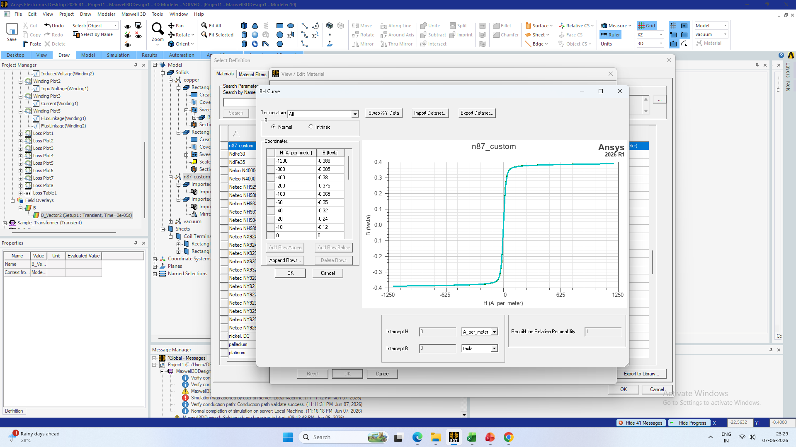

---

## Transformer Core Geometry

The EE65 ferrite core geometry was modelled in ANSYS Maxwell according to the dimensions obtained from the transformer design calculations. The custom N87 material was assigned to the core for magnetic field and core-loss analysis.

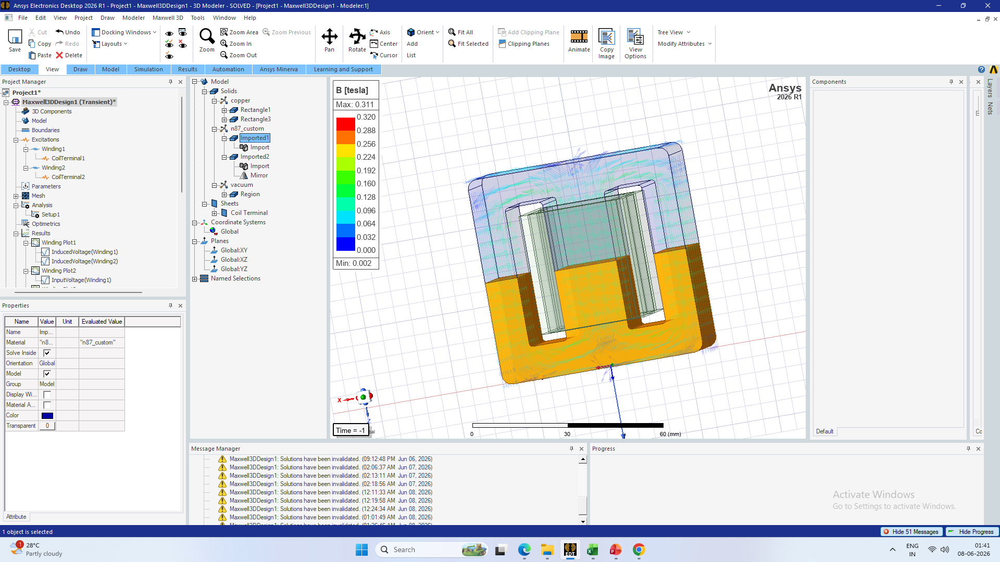

---

## Winding Geometry

Primary and secondary windings were modelled around the centre limb of the EE65 core. Copper conductors were assigned to the windings, and the number of turns was selected to satisfy the required voltage conversion ratio for the DAB converter application.

- Primary Turns: 6
- Secondary Turns: 9
- Winding Material: Copper

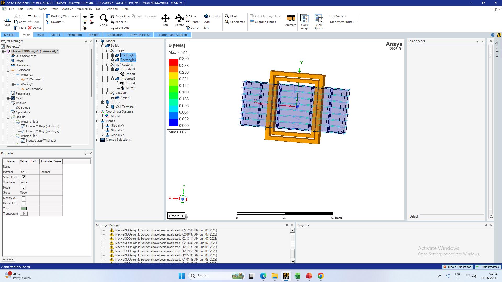

---

## Complete Transformer Model

The complete transformer model consists of the EE65 ferrite core and the corresponding primary and secondary windings. This model was used for transient simulations under both sinusoidal and square-wave excitation conditions.

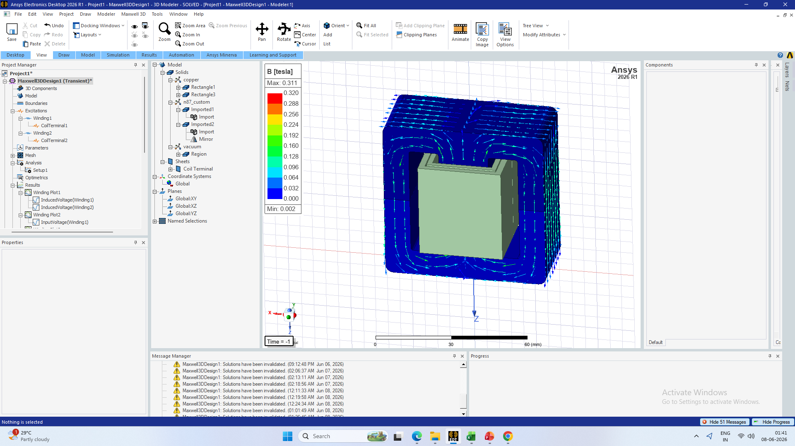

---

# Simulation Results

The transformer was analysed using the ANSYS Maxwell transient solver under both sinusoidal and square-wave excitation conditions. The objective was to verify voltage transformation, magnetizing behaviour, core losses, and magnetic flux distribution.

---

## Sinusoidal Excitation Results

The primary winding was excited using a 100 kHz sinusoidal voltage source with a peak voltage of 339 V. The secondary winding was maintained under open-circuit conditions.

### Input Voltage

### Induced Voltage

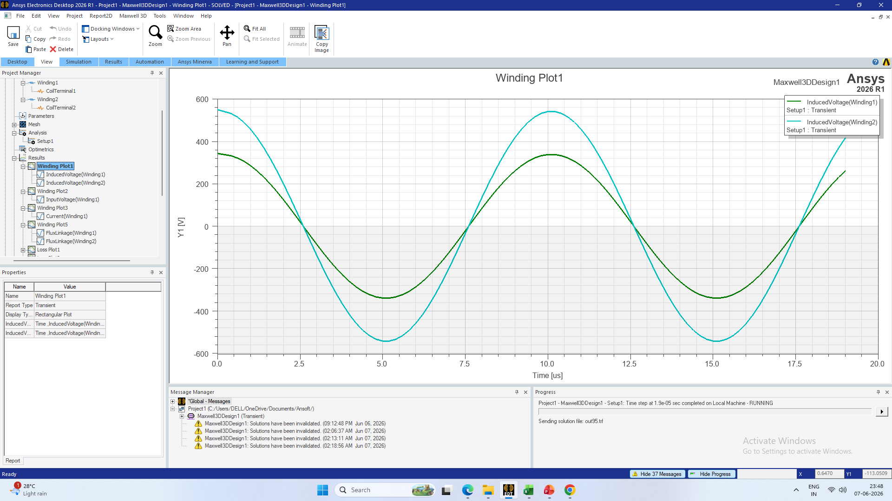

### Magnetizing Current

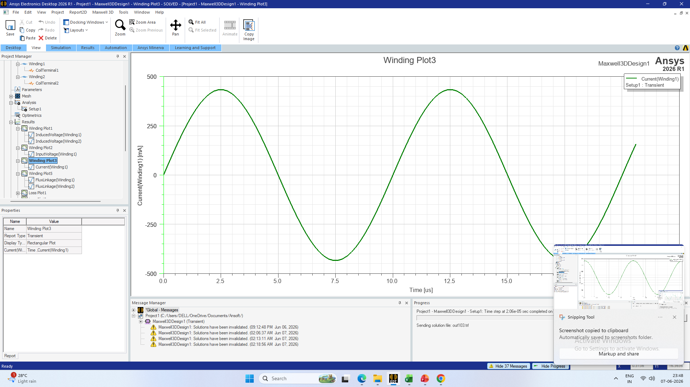

### Core Loss

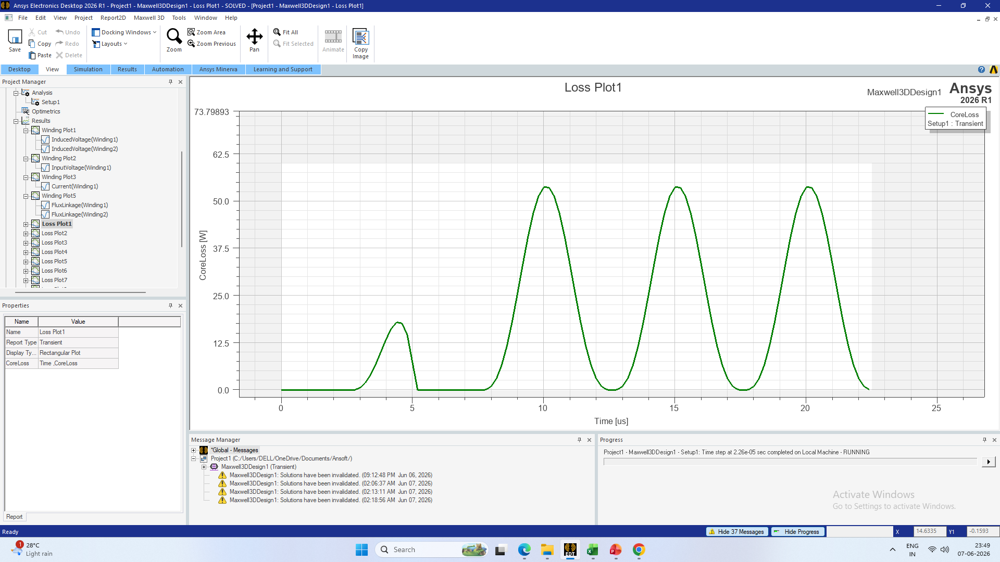

### Observations

- Transformer operation was successfully verified under sinusoidal excitation.
- Voltage transformation ratio closely matched the designed turns ratio.
- Peak flux density remained within the design target.
- Core-loss behaviour was analysed using the transient solver.

---

## Square-Wave Excitation Results

To emulate practical DAB converter operation, the transformer was excited using a 100 kHz square-wave voltage source.

### Input Voltage

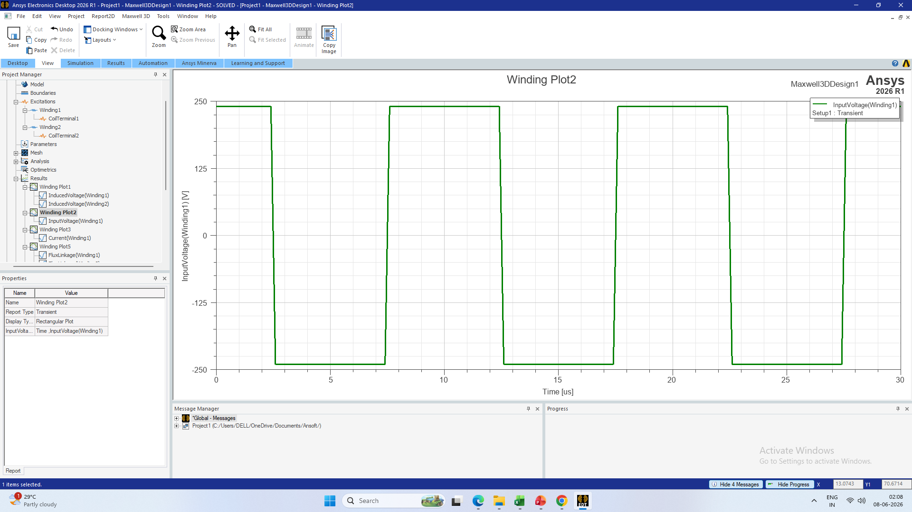

### Induced Voltage

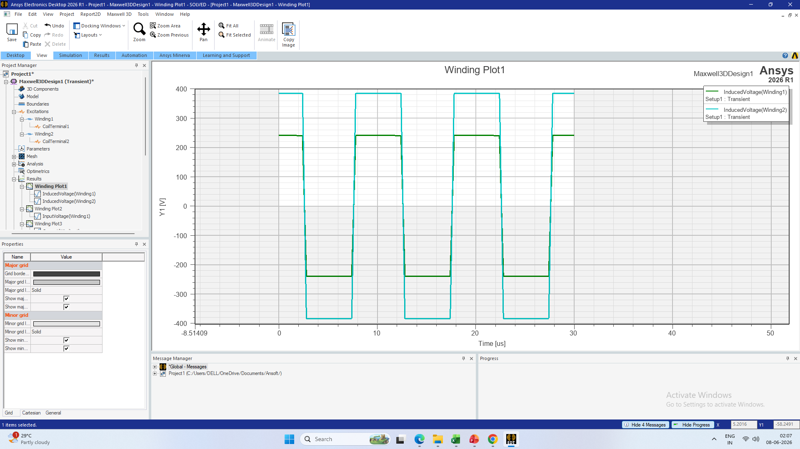

### Magnetizing Current

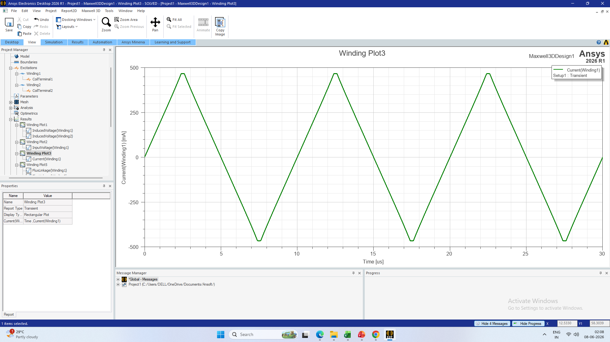

### Core Loss

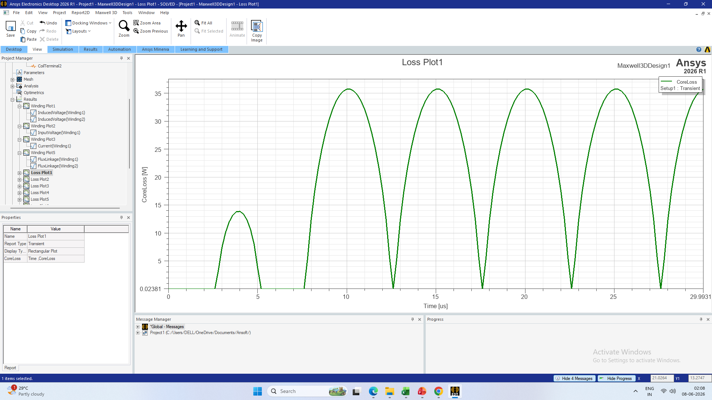

### Observations

- Transformer operation was successfully verified under square-wave excitation.
- Magnetic performance remained within the expected operating range.
- Core-loss behaviour under non-sinusoidal excitation was investigated.
- Results demonstrate suitability for DAB converter applications.

---

## Magnetic Flux Distribution

The magnetic flux distribution within the EE65 ferrite core was analysed using ANSYS Maxwell transient simulations. The flux density plots were used to verify magnetic field distribution, core utilization, and compliance with the design flux density limit of 0.2 T.

### Flux Distribution Under Sinusoidal Excitation

### Observations

- Magnetic flux is concentrated primarily within the centre limb of the EE65 core.
- Flux distribution remains symmetric throughout the magnetic path.
- Peak flux density remains close to the design target of 0.2 T.
- No significant localized saturation is observed.

---

### Flux Distribution Under Square-Wave Excitation

### Observations

- Magnetic flux follows the expected path through the ferrite core under square-wave excitation.
- The core remains within the intended operating flux density range.
- The magnetic field distribution confirms proper utilization of the magnetic material.
- The transformer is suitable for DAB converter operation at 100 kHz.

---
